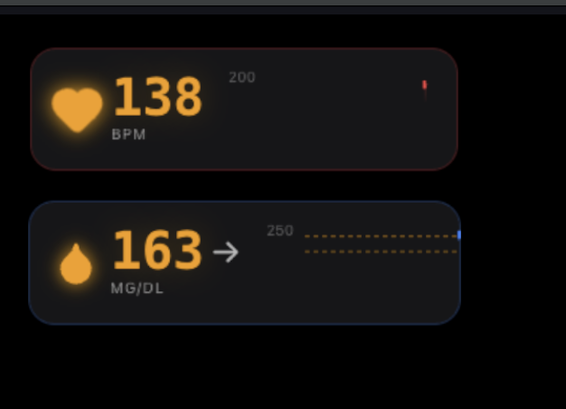

# OBS Workout Plugin

Real-time health metrics overlays for OBS. Display your heart rate and blood glucose data as browser source overlays during livestreams.



## Features

- **Heart Rate Overlay** - Live BPM display with 30-minute graph from Stromno (Pulsoid)
- **Blood Glucose Overlay** - Real-time glucose with trend indicators from Dexcom
- **OBS Browser Source Ready** - Transparent backgrounds, sized for streaming

## Prerequisites

- [Node.js](https://nodejs.org/) 18+
- [pnpm](https://pnpm.io/) package manager
- A Stromno/Pulsoid account with a widget URL (for heart rate)
- A Dexcom account (for blood glucose)

## Setup

1. Clone the repository:

   ```bash
   git clone https://github.com/gordolio/obs-workout-plugin.git
   cd obs-workout-plugin
   ```

2. Install dependencies:

   ```bash
   pnpm install
   ```

3. Start the development server:

   ```bash
   pnpm dev
   ```

4. Open http://localhost:3000 in your browser

## Usage

1. Go to the **Admin** page (http://localhost:3000/admin)
2. Enter your Stromno widget URL and/or Dexcom credentials
3. Click Connect for each service
4. Add browser sources in OBS:
   - **Heart Rate**: http://localhost:3000/heartrate (recommended: 320x100)
   - **Blood Glucose**: http://localhost:3000/glucose (recommended: 320x100)

## Setting Up Stromno (Heart Rate)

1. Create an account at [stromno.com](https://www.stromno.com/)
2. Download the Stromno app on your fitness device (smartwatch, etc.)
3. Sign in and start heart rate monitoring
4. On the Stromno website, navigate to **Widgets**
5. Copy your widget URL (looks like `https://stromno.com/widget/xxxxxxxx-xxxx-xxxx-xxxx-xxxxxxxxxxxx`)

## Tech Stack

- Next.js 16 (App Router)
- React 19
- Tailwind CSS 4
- Zustand (state management)
- TanStack React Query
- Recharts (graphs)
- SQLite (settings persistence)
